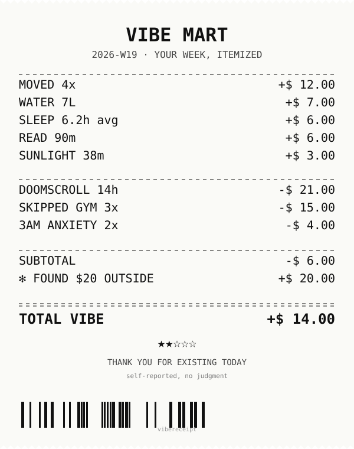

# vibereceipt — your week, itemized

<p align="center">
  
</p>

A local CLI / Claude Code skill that turns 8 quick prompts about your past 7 days into a thermal-receipt-style SVG. Credits for moving + sleeping + reading. Debits for doomscrolling + skipped gym + 3am anxiety. Self-reported. No judgment. No accounts, no OAuth — your data never leaves your laptop.

## Quick start

```bash
npx github:KeWang0622/vibereceipt
```

Answers 8 questions, drops a `vibereceipt.svg` in your current directory. Want to skip the prompts?

```bash
npx github:KeWang0622/vibereceipt --demo               # built-in demo week
npx github:KeWang0622/vibereceipt --input week.json    # JSON file with your data
npx github:KeWang0622/vibereceipt --stdout > card.svg  # pipe somewhere else
```

The card above is what `--demo` produces. Yours will look different.

## Why this matters

Receiptify proved that *itemizing your data* is a stronger share-format than charting it — 1.2M people posted Spotify receipts in three months. But Spotify only knows your listening. Your week has a lot more going on, and a lot of it is on you, not a service. vibereceipt is the receipt version of *that*: positive habits become credits, the stuff you avoided becomes debits, and the bottom line is what you choose to share.

## How it works

```
8 prompts (or JSON)  →  pricing rules  →  SVG template
                              │
                              └─ deterministic credits/debits, no randomness, no clock
```

Pricing is a 50-line lookup table in `src/pricing.ts` — tune the rules to your conscience. The SVG template is in `src/render.ts` — replace the typography, the divider style, or the barcode with whatever feels right. No external services, no telemetry, no analytics.

## Roadmap

- `--export-png` flag (rasterizer baked in) so the artifact is one-step shareable
- Custom credit/debit categories from a YAML file (kids, alcohol, screen-time-by-app, …)
- A `--week-of <date>` flag and a `weeks/<week>.json` directory convention for keeping a year of receipts

## From source

```bash
git clone https://github.com/KeWang0622/vibereceipt && cd vibereceipt
bash scripts/dev.sh install
bash scripts/dev.sh example   # writes assets/example.svg
bash scripts/dev.sh test
```

## License

MIT © 2026 KeWang0622
